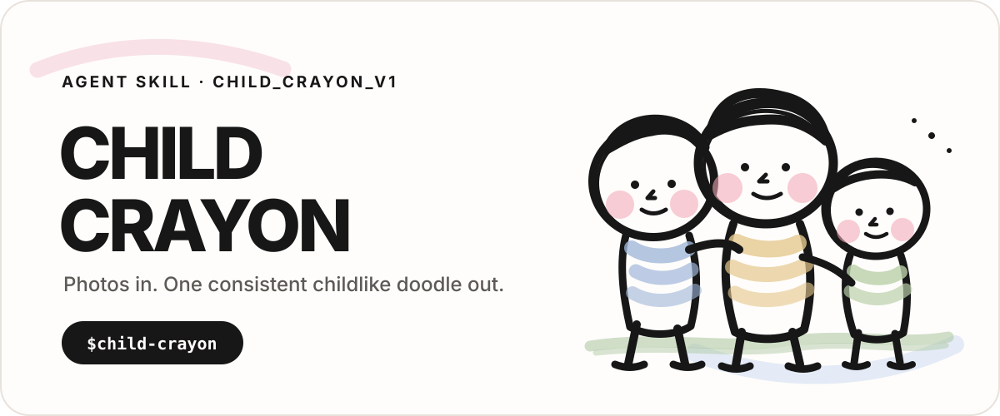
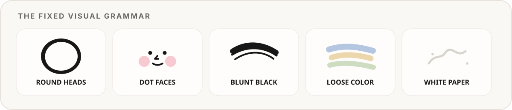
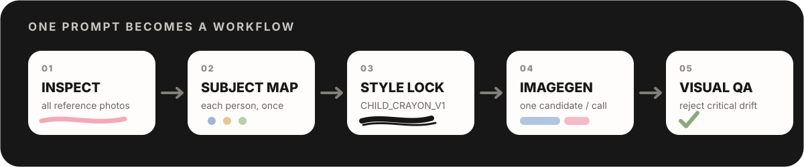

<p align="right">
  <a href="./README.md">English</a> · <strong>简体中文</strong>
</p>

<p align="center">
  
</p>

<p align="center">
  <a href="./LICENSE"></a>
  
  
</p>

**Child Crayon** 是一套可复用的 Agent Skill：把一张或多张人物参考照片，转换成**同一种稳定、稚拙、统一的儿童蜡笔涂鸦**。

它不是把一段超长提示词换个文件名。整个流程被拆成：**人物解析 → 风格锁定 → ImageGen 渲染 → 视觉验收 → 定向重试**，从而减少多人、多参考图和风格漂移时常见的不稳定问题。

<p align="center">
  
</p>

## 它优先保护什么

| 强力保留 | 主动简化 |
| --- | --- |
| 真实人物数量必须正确 | 写实五官和成人面部结构 |
| 同一个人只能出现一次 | 标准成人身体比例 |
| 左右顺序与人物关系 | 照片里的光影和空间深度 |
| 拥抱、牵手、托举、依偎等互动 | 建筑、车辆、家具等复杂背景 |
| 发型轮廓、服装、代表性配饰 | “专业插画师画得很精致”的感觉 |

人物辨识主要依靠**发型、服装、配饰、体型差异、站位与互动**，而不是通过增加真实眉眼、鼻孔、嘴唇或下颌线来追求肖像相似度。

<p align="center">
  
</p>

## 安装

### 方式一 · Skills CLI

```bash
npx skills add erwanjun/child-crayon-skill
```

### 方式二 · 直接让 Agent 安装

```text
Install this Skill: https://github.com/erwanjun/child-crayon-skill
```

### 方式三 · 手动复制

把 `skills/child-crayon/` 放进你的 Agent Skills 目录。

真正的位图渲染交给已安装的 **`imagegen`** Skill，本仓库负责稳定的照片理解、风格约束、提示词编译和视觉验收。

## 使用

```text
用 $child-crayon 把这些家庭照片画成固定的儿童蜡笔涂鸦。每个真实人物只能出现一次，只输出一张最终图。
```

```text
用 $child-crayon。第一张照片负责构图，第二、三张只补充发型和眼镜，不要把多张照片拼贴起来。
```

```text
Use $child-crayon on these photos. Preserve the relationship and clothing, but keep every face in the fixed minimal grammar.
```

更多示例见 [`examples/`](./examples/README.md)。

## 固定的视觉语法

当前风格版本为 `CHILD_CRAYON_V1`：

- 明显偏大的、不完全规则的大圆头；
- 两个很小的黑点眼睛，或两条很短的闭眼弯线；
- 极小的 L 形 / 弯钩鼻子；
- 一条短线或一个小圆嘴；
- 两侧浅粉色圆形蜡笔腮红；
- 钝头粗黑蜡笔反复描出的、粗细不匀且轻微颤抖的轮廓；
- 低饱和、松散、不涂满、明显露白的彩色蜡笔填色；
- 脸、耳朵、脖子和手大部分保留白纸原色；
- 背景默认干净白纸，只在有纪念意义时留下极少的象征性环境元素。

完整硬性规范见 [`style-spec.md`](./skills/child-crayon/references/style-spec.md)。

它会明确拒绝：写实肖像、精致日漫 Q 版、商业卡通、干净矢量线稿、彩铅、水彩、3D/黏土/毛毡、渐变和阴影、写实肤色、复杂背景、额外人物、重复人物、拼贴、签名和水印。

## 为什么不只放一段超长 Prompt？

长 Prompt 可以描述风格，但 Skill 可以管理一个**可重复执行的工作流**：

1. 检查用户上传的全部照片；
2. 建立“唯一人物映射”，避免同一个人在多张参考图里被重复生成；
3. 只选择一张主构图，而不是把多个场景平均或拼贴；
4. 用版本化文字规范 + 可选 Style Anchors 锁定风格；
5. 通过 `$imagegen` 每次只生成一个候选；
6. 用视觉 QA 拒绝关键错误；
7. 只针对失败维度重试，尽量不破坏已经正确的部分。

这才是这个仓库真正想工程化的东西。

## 视觉验收门槛

只要出现以下任一情况，就应该拒绝当前结果并定向重试：

- 人物数量错误；
- 人物缺失、重复或合并；
- 核心人物关系丢失；
- 出现写实成人脸型或五官；
- 身体回到标准成人比例；
- 黑线变成平滑、纤细、均匀的数字线稿；
- 填色变成实心、光滑、带阴影、渐变或写实肤色；
- 背景变得复杂写实；
- 出现文字、Logo、签名、水印、边框或拼贴布局。

完整规则见 [`qa-checklist.md`](./skills/child-crayon/references/qa-checklist.md)，定向修复策略见 [`failure-recovery.md`](./skills/child-crayon/references/failure-recovery.md)。

## Style Anchors

**文字负责边界，优秀成图负责审美中心。**

以后如果你选出了 3–6 张“这就是我要的味道”的结果，可以放到 [`assets/style-anchors/`](./assets/style-anchors/README.md)：

```text
anchor-single.png
anchor-couple.png
anchor-family.png
anchor-group.png
```

Skill 会先读取文字硬规则，再把这些真实样例当作风格中心参考。

本仓库不会为了 README 好看而假装 SVG 涂鸦就是模型真实输出，也不会默认公开任何私人家庭照片。

## 仓库结构

```text
child-crayon-skill/
├── README.md
├── README.zh-CN.md
├── assets/
│   ├── readme/                 # GitHub-safe SVG 视觉层
│   └── style-anchors/          # 可选的 canonical 成图
├── skills/
│   └── child-crayon/
│       ├── SKILL.md            # 执行契约
│       ├── agents/openai.yaml  # Agent UI 元数据
│       └── references/
│           ├── style-spec.md
│           ├── subject-analysis.md
│           ├── generation-spec.md
│           ├── qa-checklist.md
│           └── failure-recovery.md
├── evals/                      # 回归测试骨架；不放私人照片
└── examples/
```

## 从“感觉”走向 Evals

[`evals/`](./evals/README.md) 目前只是一个轻量骨架，但方向很明确：以后用取得授权的测试照片，持续验证人物数量、多参考图去重、互动关系、五官语法、粗黑线、露白填色和背景简化是否发生回归。

如果未来确实想改变风格，应该发布新的 Style Version，而不是悄悄改变 `CHILD_CRAYON_V1`。

## 隐私

人物照片经常包含高度私人的内容。**不要把私人照片提交到公开仓库。** 本地评测素材可以放在已被 `.gitignore` 忽略的 `private/` 目录；公开 Style Anchor 前，请确认你拥有再分发权利。

## 贡献

欢迎提交真实可复现的边界案例、更好的 QA 规则、多图人物解析策略、定向修复规则和文档改进。详见 [`CONTRIBUTING.md`](./CONTRIBUTING.md)。

## 致谢

README 的组织方式参考了 [`oil-oil/beautify-github-readme`](https://github.com/oil-oil/beautify-github-readme) 的 project-native 思路：视觉资产负责建立项目身份，但真正的解释、命令和工程约束仍保留在可搜索、可复制、可维护的 Markdown 中。

图片生成部分则与 Codex 的 `imagegen` Skill 组合，而不是在这里重复造一套图片生成工具。

MIT License
